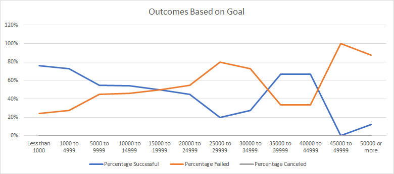

# Kickstarting with Excel

## Overview of Project

### Purpose
The purpose of this analysis was to see how the different campaigns fared in relation to their launch dates and their funding goals.

## Analysis and Challenges

### Analysis of Outcomes Based on Launch Date
When comparing the different outcomes to their launch dates, we can see an acute increase in successful outcomes when transitioning from April into May. From May, the number of successful outcomes starts to decline slightly in June and July, and continues to decline into September. May has the highest number of successful outcomes at 111. 

### Analysis of Outcomes Based on Goals
When comparing the number of outcomes against the goal, we see a direct inverse between successful and failed outcomes since there are no canceled outcomes for the ‘plays’ subcategory. There are more successful outcomes from less than 1000 all the way to 1500 to 19999. This is where the outcomes start tending in the opposite direction as more outcomes are failed. Failed outcomes have a higher percentage all the way to 30000 to 39999 when the failed percentage becomes lower than the successful percentage. The failed percentage increases again and overtakes successful outcomes at 45000 to 49999 where failed reaches 100%. 

### Challenges and Difficulties Encountered
The main challenge in the analysis came from calculating the number if successful and failed outcomes for each goal. The COUNTIFS function has to be very exact and any incorrect variable can result in an error. Also, if the correct range is not used the resulting line graph will be inaccurate. I had to modify a few cells with the correct range in the function to ensure the line graph was correct. 

## Results

- What are two conclusions you can draw about the Outcomes based on Launch Date? 
1. May has the highest number of successful outcomes. Moreover, the months following May also have a higher number of successful outcomes compared to other months in the year. The late spring months and all the summer months have a higher success. This could be due to the general increase in visits to the theater during the summer compared to other times of the year. The failed outcomes were also highest in May which is probably due to the overall increase in shows. 
2. The failed outcomes total was also very high in October when there were not any canceled shows which may be why the failed total is so high. These shows probably should have been canceled.

- What can you conclude about the Outcomes based on Goals?
The highest success rate occurs when the goal is at the lowest amount. This trend continues until 15000 to 19999, and reappears into the 35000 to 39999 range. For the most part, the success rate is higher when the goal is lower.

- What are some limitations of this dataset? 
Deliverable 2 only utilizes the ‘plays’ subcategory which does not have canceled shows. I would want to see how having canceled shows factors into the comparison to the other outcomes. 

- What are some other possible tables and/or graphs that we could create?
I think it would be interesting to view other subcategories instead of just plays. The plays did not have canceled shows, I would want to see the comparison of another type of show to see how the three outcomes compare to each other based on goals. 
